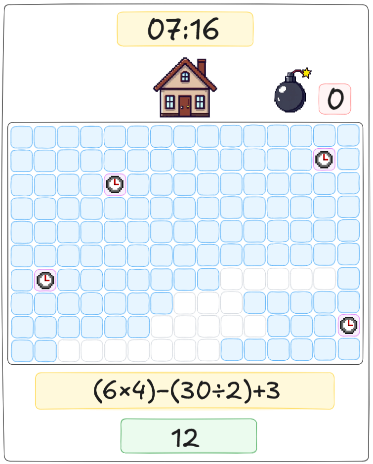

# Harjoitustyön suunnitelma

## Tietoja 

Tekijä: Matias Turpeinen

Työ git-varaston osoite: <https://github.com/MatiasTTT/ohj1ht> 

Pelin nimi: MatikanMaisteri

Pelialusta: Windows

Pelaajien lukumäärä: 1

## Pelin tarina

Pelaaja on MatikanMaisteri, jonka tehtävänä on murtaa tiilimuuri päässälaskutaitojensa avulla.  
Muurin jokainen rivi voidaan murtaa vain ratkaisemalla oikein satunnaisesti esitettyjä laskuja.  
Oikeasta vastauksesta saa pommin, joka murtaa tiiliä muurista.  
Jos pelaaja ehtii muurin läpi ennen kuin aika loppuu, hän voittaa.  

## Pelin idea ja tavoitteet

- Pelaajalle näytetään satunnainen lasku (esim. yhteen-, vähennys-, kerto- tai jakolasku).  
- Pelaaja syöttää laskun vastauksen näppäimistöllä.  
- Oikeasta vastauksesta syntyy pommi, jonka teho = laskun tulos (esim. 6 → rikkoo 6 tiiltä).  
- Pudotusalue ilmestyy etenemisriville:  
  - Pelaaja liikuttaa aluetta nuolinäppäimillä vasemmalle/oikealle.  
  - Jos alue on vertikaalisesti katsottuna yhteydessä edelliseen aukkoon vähintään yhdellä tiilellä → alue on vihreä (pudotus sallittu).  
  - Jos yhteyttä ei vertikaalisesti katsottuna edelliseen aukkoon ole → alue on punainen (pudotus estetty).  
  - Pommi pudotetaan välilyönnillä.  
- Jos pommi osuu kellosymboliin murrettavalla rivillä → pelaaja saa +20 sek lisäaikaa.   
- Tavoite: päästä 10×15 tiilimuurin läpi ylös asti ennen kuin aika (10 min) loppuu.  

## Hahmotelma pelistä

## Toteutuksen suunnitelma

**Lokakuu**

- Luo projektin perusrakenne Jypelillä.  
- Toteuta tiilikenttä (10×15) ja ajastin.  
- Toteuta laskujen lista ja satunnainen valinta.  

**Marraskuu**

- Tee vastausten tarkistus ja pommin luonti.  
- Toteuta pudotusalueen logiikka (nuolinäppäimet, vihreä/punainen, välilyönti).  
- Lisää kellobonukset (+20 sek).

**Jos aikaa jää**

- Lisää grafiikoita ja äänitehosteita.  
- Viimeistele käyttöliittymä (selkeä laskualue, syöttöalue, kellonäkymä).  
- Tee laajempi testaus ja bugien korjaukset.  
