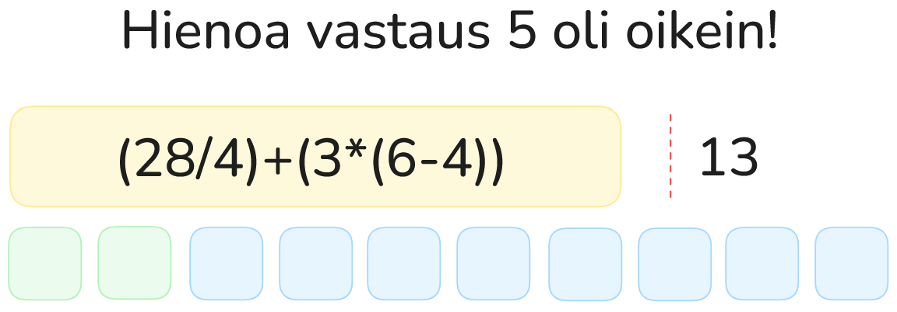

# Harjoitustyön suunnitelma

## Tietoja

**Tekijä:** Matias Turpeinen  

**Työ git-varaston osoite:** [https://github.com/MatiasTTT/ohj1ht](https://github.com/MatiasTTT/ohj1ht)  

**Pelin nimi:** MatikanMaisteri  

**Pelialusta:** Windows  

**Pelaajien lukumäärä:** 1  

---

## Pelin tarina

Pelaaja on MatikanMaisteri, jonka tehtävänä on ratkaista päässälaskuja ja edetä sinisten tiilien polulla
alusta loppuun saakka. Jokaisesta oikein ratkaistusta laskusta pelaaja etenee yhden askeleen eteenpäin polulla.  
Kun pelaaja on vastannut oikein kymmeneen laskuun, polku on värjäytynyt kokonaan vihreäksi ja hän voittaa pelin.  
Jos vastaus on väärä, pelaaja pysyy paikallaan ja saa uuden kysymyksen.

---

## Pelin idea ja tavoitteet

- Pelaajalle näytetään satunnainen lasku listasta (esim. yhteen-, vähennys-, kerto- tai jakolasku).  
- Pelaaja syöttää vastauksensa näppäimistön kautta ja painaa **Enter**.  
- Jos vastaus on oikein → pelaaja siirtyy yhden tiilen eteenpäin.  
- Jos vastaus on väärin → pelaaja ei liiku ja saa uuden laskun.  
- Peli etenee näin, kunnes pelaaja on ratkaissut **10 laskua oikein**.  
- Kun kaikki 10 askelta polulla on suoritettu, polku on täynnä ja peli päättyy **voittoon**.  

---

## Hahmotelma pelistä

---

## Toteutuksen suunnitelma

### Lokakuu

- Projektin luonti Jypelillä ja perusnäkymän rakennus (laskualue, vastauskenttä ja polku).  
- Lista toteutus laskujen ja vastausten osalta.  
- Satunnaisen laskun arvonnan ja sen pelaajalle näyttämisen tekeminen.  
- Vastausten tarkistuksen toteutus.  
- Etenemislogiikan lisäys: oikeasta vastauksesta siirtyminen seuraavaan laatikkoon.  
- Jonkinlainen voittotarkistuksen toteutus, kun pelaaja on saavuttanut kymmenennen tiilen.